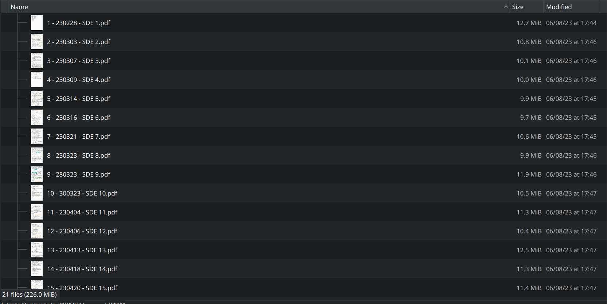

# pdfunite-tree
This tool allows the user to concatenate all the pdfs in a tree and to append a ToC to them which reflects the structure of the tree

## Problem

I want to reorganise my whole university library more properly. To do that I sometimes need to unite numerous pdf files all together (e.g. my homeworks for GIP or my notes of SDEs). 

If there are many pdf files and I must do one single from all of them, I want to have a Table of Content (ToC) which shows me the position of the single individual file in the big pdf where the files are united together (extra: and possibly even an index in the beginning). If I do not have it, the file bundled together will become unuseful, because I will not know how to find informations quickly.

It would be good also to have the same idea, but with 2 or 3 levels of folders/files.

I also found that there is a command line tool which does more or less the opposite of what I am trying to achieve: https://github.com/einoko/pdf-toc-splitter

Online there are tools to manage pdfs (e.g. [`HandyOutliner`](https://handyoutlinerfo.sourceforge.net/)), but they are not automatised to tackle the task I try to harness. Thus I would need a script which takes all pdf files in a folder, unites them, and create manually an index for the obtained file signing at which page does the n-th file start. The solution is not practical, I think it is thus better to write a tool which unites the files with `pdfunite` and index the output with `pdf.tocgen`.

### Tests

If you want to run the tests you will need to install these command line tool:
- `qpdf`, `pdfinfo` and `pdftotext` for checking the pdf validity